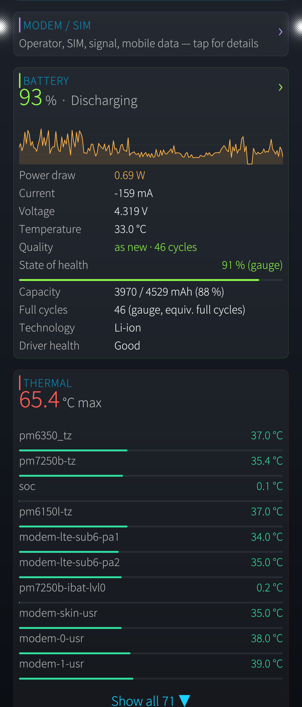
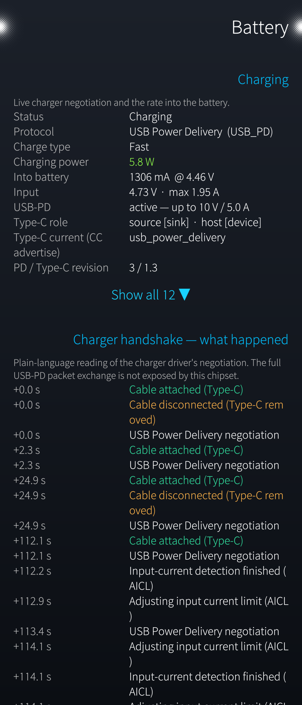
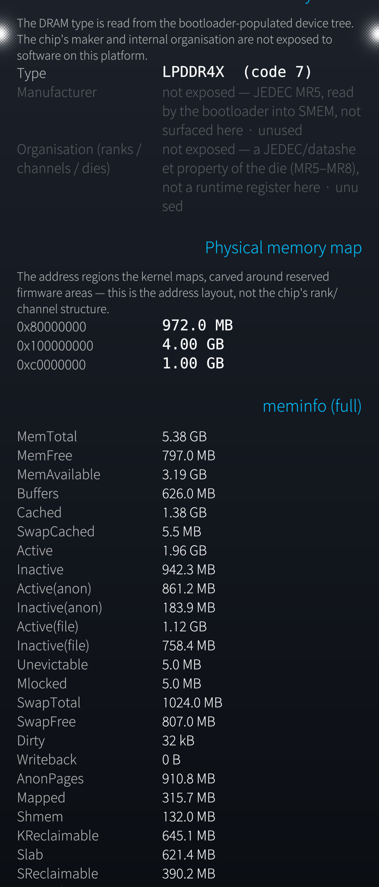
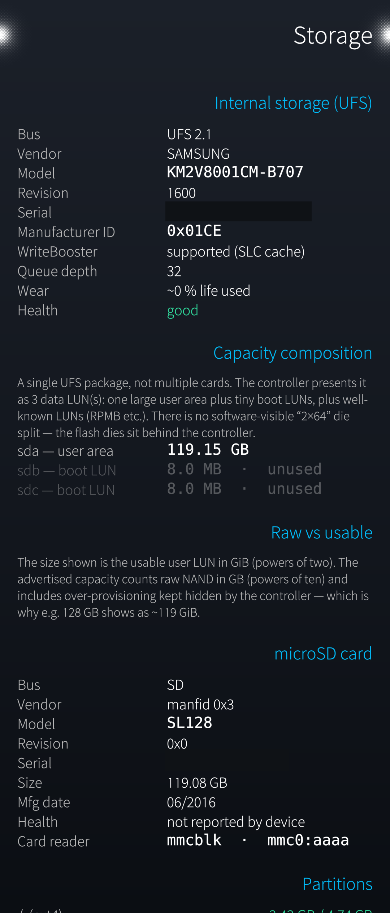
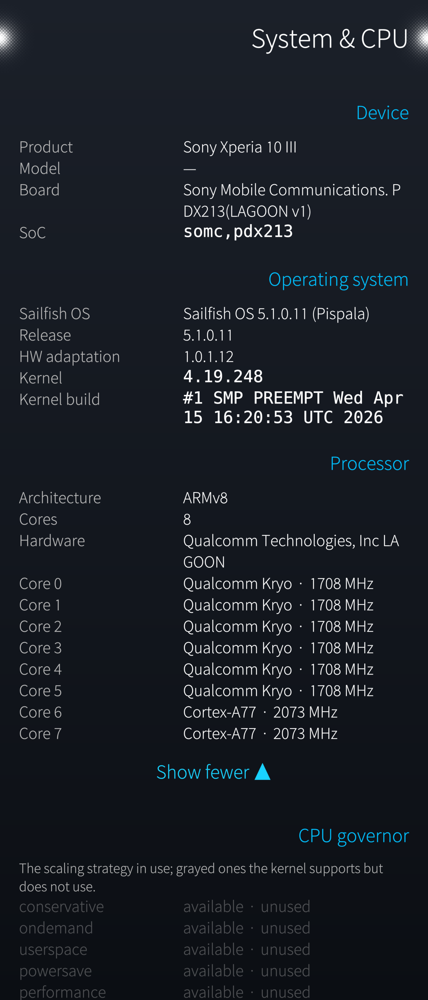

# harbour-sysmetrics

**SysMetrics is an on-device deep system and hardware diagnostics tool for Sailfish OS.** 

Intended primarily for developers, testers and advanced users. Some features 
require elevated privileges. It reads /proc, /sys and the system D-Bus locally 
and shows what the device reports about itself. Everything runs on the device: 
it collects nothing, transmits nothing, and has no network or cloud component. 
The only data it ever shows is that of the phone it runs on.**

SysMetrics is an htop-style monitor that also opens up every hardware subsystem
of the phone on its own detail page. It reads `/proc`, `/sys` and the system
D-Bus locally and shows what the device reports about itself. Everything runs on
the device: it **collects nothing, transmits nothing, and has no network or
cloud component**. The only data it ever shows is that of the phone it runs on.

Tested on a Sony Xperia 10 III. The hardware readouts are written to degrade
gracefully on other devices — where a value is not exposed by the kernel, the
app says so instead of guessing.

## Screenshots

<table>
  <tr>
    <td></td>
    <td></td>
    <td></td>
    <td></td>
  </tr>
  <tr>
    <td></td>
    <td></td>
    <td></td>
    <td></td>
  </tr>
  <tr>
    <td></td>
    <td></td>
    <td></td>
    <td></td>
  </tr>
</table>

## What it shows

- **Processes** — a live list sorted by CPU, with a collapsible top-10 view. The
  ordering freezes while a row is touched so it can be tapped without jumping.
  Each process opens a detail page: per-process CPU, memory, I/O, scheduling,
  open files, device nodes and network sockets.
- **System overview** — CPU (per core and total, with history graphs), memory,
  thermal zones, load recording for later analysis.
- **Connections** — inbound and outbound sockets with a public/private/loopback
  classification and a threat-assessment view; tap a connection for its detail.
- **Hardware detail pages**, each a tap away:
  - **CPU / SoC**, **RAM** (type and timing where exposed).
  - **Storage** — UFS/eMMC identity, health/wear estimate, and the capacity
    composition (LUNs), plus any microSD card and its host controller.
  - **Network** — interfaces, and live Wi-Fi detail via `iw` (SSID, BSSID, band,
    channel, signal, rates, per-band channel capabilities).
  - **Battery** — charge state, health, charging protocol and negotiated power,
    top CPU consumers, and a human-readable charger handshake from the kernel log.
  - **Bluetooth**, **Graphics**, **Audio** (sinks/sources with levels).
  - **Camera** — sensor models recovered from the vendor camera modules, the
    CAMSS layout, and an honest account of what only a live capture session can
    report.
  - **USB** — host controllers and connected devices with human-readable names
    (from the system USB-ID database) and their associated `/dev` nodes.
  - **Modem / SIM** — operator, registration, radio technology, signal, and SIM
    details, read from ofono.
  - **Sensors / GPS** — a live raw-value readout of the motion, environment and
    positioning sensors.
- **Context glossary** — every detail page carries a swipe-left glossary that
  explains exactly the terms on that page.
- **English and German**, switchable in Settings (or follow the system locale).

## Optional root mode

A few things — inspecting foreign or sandboxed processes in full, and reading
the charger handshake from the kernel ring buffer — need privileges the app does
not have as a normal user. For those, a switch in Settings (off by default)
starts an **optional** privileged helper service
(`data/harbour-sysmetrics-helper.service`, never enabled at boot; a polkit rule
scopes the switch to exactly this unit). The helper exits by itself when the app
is gone. It is strictly additive: the whole app builds and runs without it, and
nothing leaves the device either way.

## Privacy

- All processing is **on-device**. No analytics, no upload, no network calls of
  its own.
- The app shows the state of **the phone it runs on** — including identifiers
  like IMEI/IMSI that belong to that device. None of it is stored or sent
  anywhere; it is read live and shown on screen only.
- This repository contains **no** real device identifiers, serials, MAC or IP
  addresses, coordinates or personal data, and it must stay that way.

## Building

Requires the [Sailfish OS SDK](https://sailfishos.org/develop/). From the
project root:

```sh
mb2 -t SailfishOS-<version>-aarch64 build    # produces an RPM under RPMS/
```

Install on the device:

```sh
scp RPMS/harbour-sysmetrics-*.aarch64.rpm <device>:/tmp/
ssh <device> 'pkcon install-local -y /tmp/harbour-sysmetrics-*.aarch64.rpm'
```

## Status & responsible use

**Work in progress**, shared **as is** with **no warranty** of any kind (see the
GPLv3). Where the kernel or HAL does not expose a value, the app is honest about
it rather than inventing one — a blank field means "not readable here", not
"nothing there".

## Unsupported or misbehaving hardware

The hardware readouts are tuned on a Qualcomm device (Sony Xperia 10 III) and a
MediaTek one. On other SoCs some values may be blank or wrong where the kernel
exposes them under different paths. If you run different hardware and spot a
readout that is missing or incorrect, run the bundled probe and share its output
so support can be added:

```sh
sh tools/hw-probe.sh    # writes sysmetrics-hwprobe-<model>-<date>.txt
```

Attach that file to a [new issue](https://github.com/JimKnopfIoT/harbour-sysmetrics/issues),
or send it to the developer. It contains only hardware/kernel capability
information — CPU, GPU, camera, thermal and power-supply paths — and **no**
serials, subscriber data or other personal information.

## License

Licensed under the **GNU General Public License v3.0 or later** (see
[`LICENSE`](LICENSE)).
