# SysMetrics

System diagnostics for Sailfish OS. htop-class process monitor plus system,
network, device and battery inspection — and read-only diagnostics that
recognise documented device issues and explain their fixes.

## Features

- Process list: CPU%, RSS, state, threads, nice, user; sort by any key;
  text search; filters for apps / system / kernel threads.
- Process detail: CPU history, PSS/USS/swap, I/O rates, context-switch and
  page-fault rates, open files with mode, accessed /dev nodes with full
  sysfs identification (vendor, product, serial, driver), network sockets
  with live activity indication, threads, cgroup, estimated power share,
  rule-based load/drain assessment.
- Actions: SIGTERM, SIGKILL, SIGSTOP/SIGCONT, renice (lowering only).
- System overview: per-core load and frequency, memory, network and disk
  rates, thermal zones, battery (current, voltage, power, health),
  Bluetooth connections (BlueZ).
- Record mode: accumulates per-process CPU time over a session and ranks
  the consumers.
- Diagnostics on every subsystem page (facts first, findings at the end):
  CPU hardware vulnerabilities (only issues that can affect this
  architecture; green = kernel mitigation active), cpufreq governor health
  and tuning assessment, per-touch CPU boost, GPU idle floor,
  frequency-residency energy headroom, D-state-inflated load average,
  MediaTek core-hotplug health, duplicate-BT-adapter/rfkill artifacts, WLAN
  regulatory domain and firmware-crash counters, the Xperia 10 III
  camera-provider crash (missing HAL library, detected incl. installed
  fix) and the too-quiet-recordings camcorder gain. Verdict up front,
  measured details behind a tap, known fixes named as plain text —
  informs only, never changes the system. The overview cards carry a dot
  when their subsystem has a finding.
- Chipset identity: WLAN/BT combo chip from driver, device tree and
  firmware (Qualcomm and MediaTek patterns), USB controller (UDC, DT
  compatible, speeds, Type-C roles), SoC part number from /sys/devices/soc0,
  registered Android HAL services via binder.
- Android base under System & CPU: Android version, security patch level,
  vendor build and fingerprint of the HAL layer.
- Bug reports page: copy-ready device summary (with a fill-in skeleton for
  the reporter's part) and a log-info generator — name a component and get
  its exact package versions, running processes and, with root mode,
  matching journal/kernel-log lines as one copyable block.
- Glossary explaining every figure, including the technical background of
  the vulnerability classes and the camera-crash fix.
- Optional root helper (read-only, off by default) unlocks debugfs details
  such as the WLAN firmware identity and journal excerpts.

Everything is read from /proc, /sys, D-Bus and rpm on the device. The base
app never talks to the network.

## Screenshots

<table>
<tr>
<td align="center" width="25%"><a href="screenshots/01.png">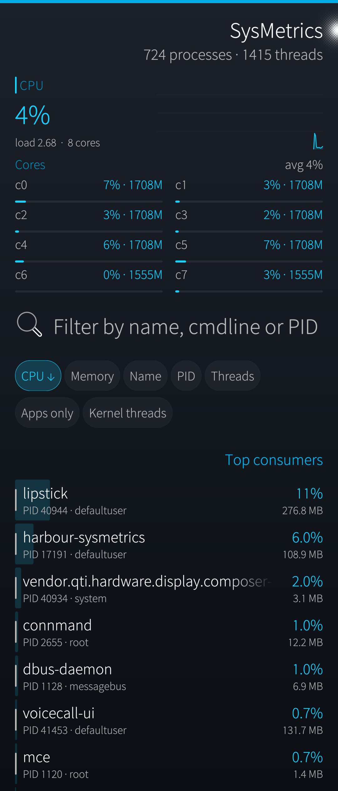</a> <b>1</b> · Process list</td>
<td align="center" width="25%"><a href="screenshots/02.png">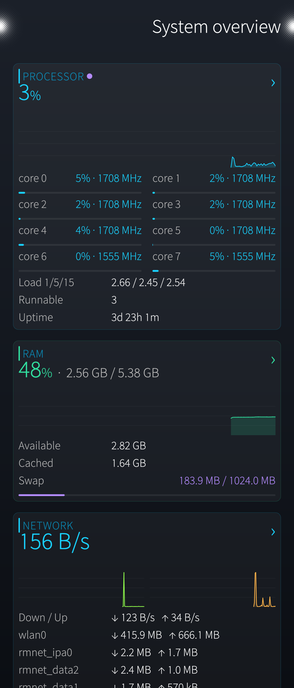</a> <b>2</b> · System overview</td>
<td align="center" width="25%"><a href="screenshots/03.png">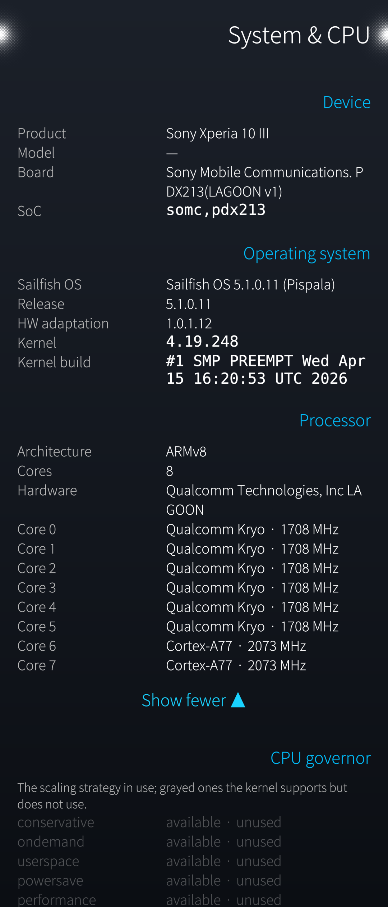</a> <b>3</b> · System &amp; CPU</td>
<td align="center" width="25%"> <b>4</b> · Subsystem cards</td>
</tr>
<tr>
<td align="center"> <b>5</b> · Storage</td>
<td align="center"><a href="screenshots/06.png">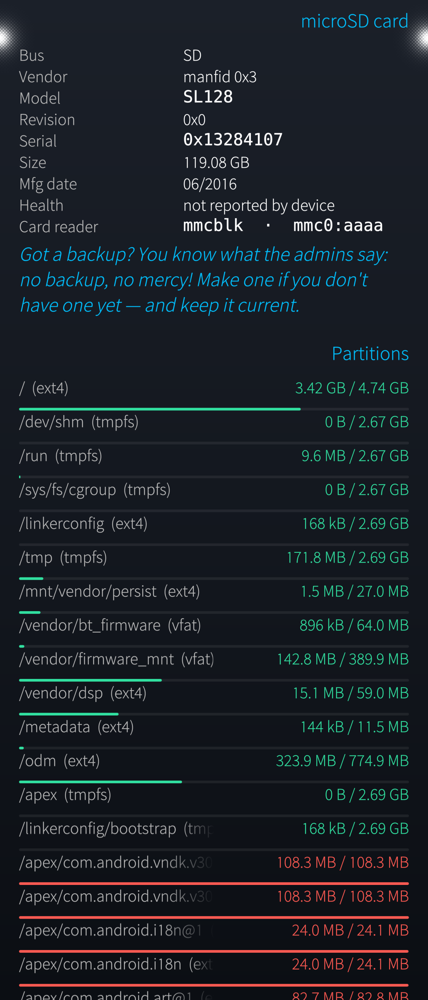</a> <b>6</b> · Partitions &amp; microSD</td>
<td align="center"> <b>7</b> · Battery &amp; thermal</td>
<td align="center"> <b>8</b> · Charger handshake</td>
</tr>
<tr>
<td align="center"><a href="screenshots/09_USB.png">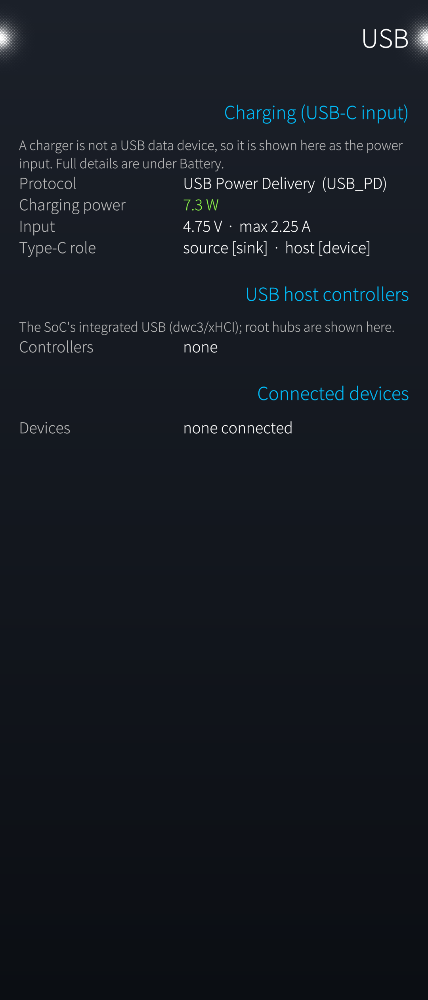</a> <b>9</b> · USB — charging</td>
<td align="center"><a href="screenshots/10_USB2.png">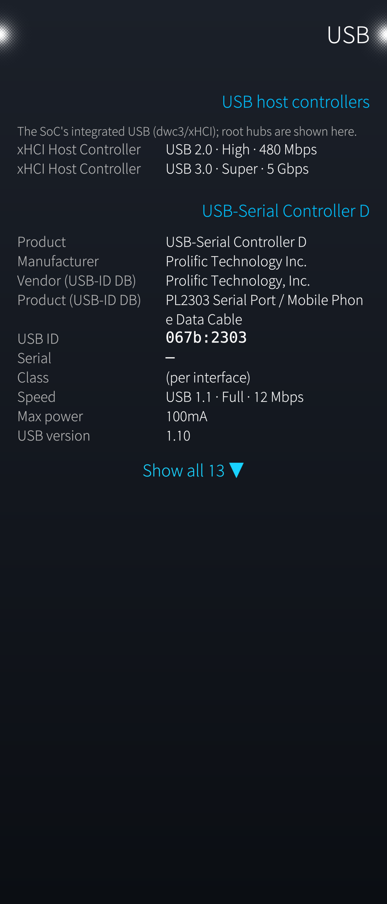</a> <b>10</b> · USB — connected device</td>
<td align="center"><a href="screenshots/12_Cam1.png">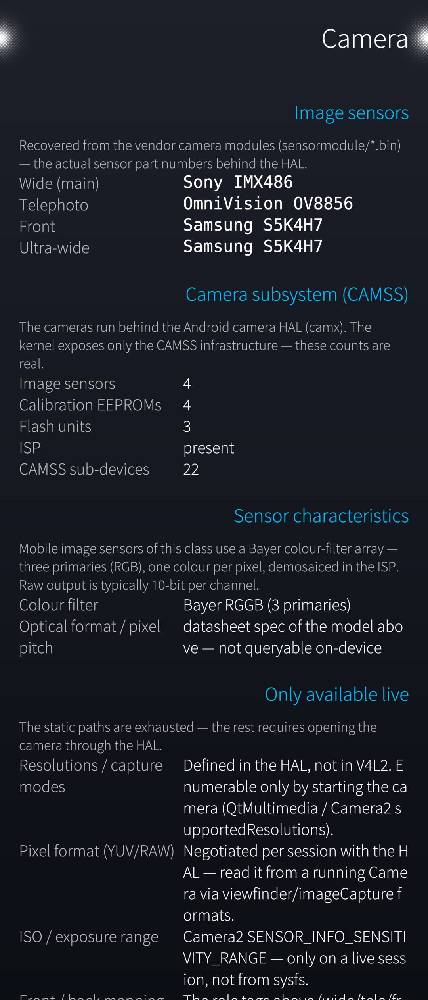</a> <b>11</b> · Camera sensors</td>
<td align="center"><a href="screenshots/13_Cam2.png">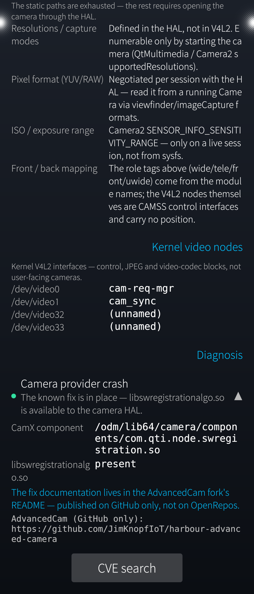</a> <b>12</b> · Camera diagnosis</td>
</tr>
<tr>
<td align="center"><a href="screenshots/14_Audio.png">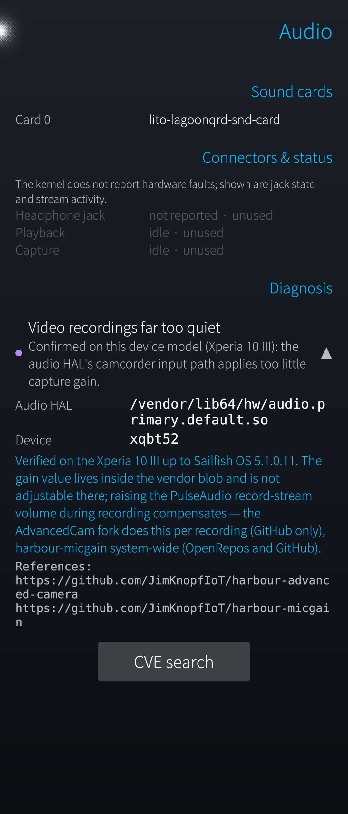</a> <b>13</b> · Audio diagnosis</td>
<td align="center"><a href="screenshots/15_Bugrepo1.png">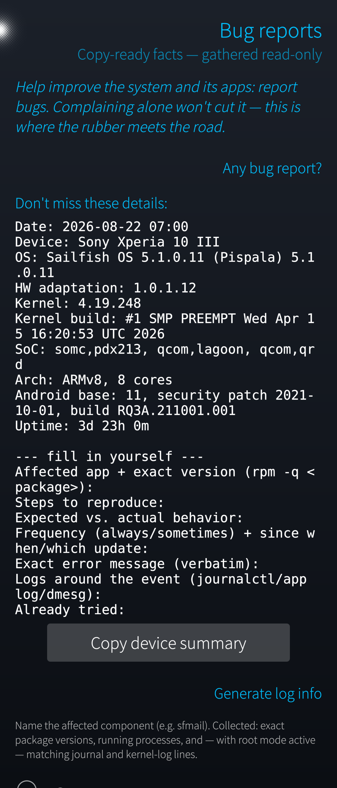</a> <b>14</b> · Bug reports</td>
<td align="center"><a href="screenshots/16_Bugrepo2.png">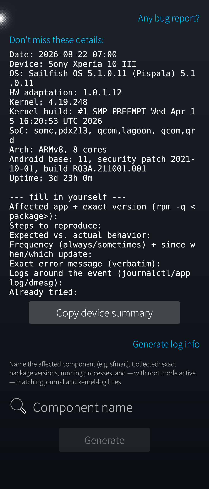</a> <b>15</b> · Device summary &amp; log info</td>
<td align="center"><a href="screenshots/17_Ram1.png">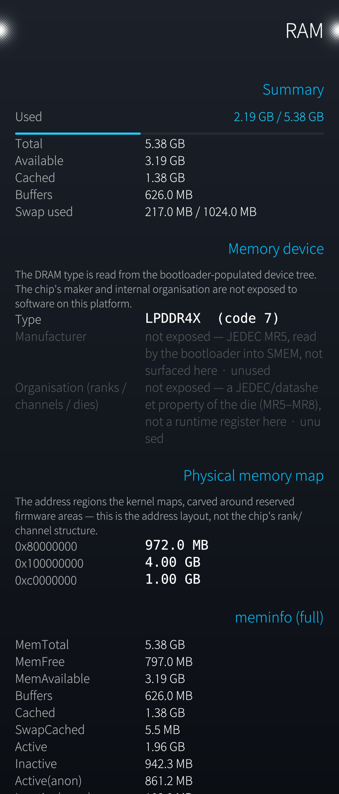</a> <b>16</b> · RAM</td>
</tr>
</table>

## Build

    mb2 -t SailfishOS-5.0.0.62-aarch64 build

### Ultimate variant (self-built)

    mb2 -t SailfishOS-5.0.0.62-aarch64 build -- --with ultimate

Adds an online CVE search to the diagnosis blocks — the only feature that
talks to the network, which is why it stays out of default builds. It
queries the ENISA EUVD and flags hits against the CISA known-exploited
catalog. Search presets are context-aware (the network page seeds the radio
chip and its stack, the CPU page kernel/SoC/Android, …), every page starts
with an empty query, and each result carries a local fix verdict: ✔ not
affected or fixed (rpm changelog names the CVE, or the installed version
lies above the affected range stated in the CVE), ✘ probably affected
(version inside the range, or the package predates the CVE), ▢ unknown.

## License

GPL-3.0-or-later
